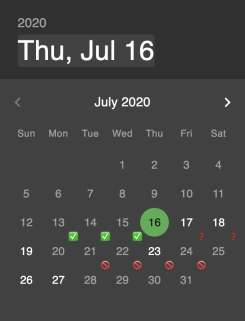

# Board Game Sharing

Are you a board game enthusiast who wants to loan your collection out to others but has a hassle keeping track of all the logistics? Well then this is the site for you!

From your profile page you can display all the games you want to loan out to other so they can view those games and request specific days to borrow them.

You can make an account to add games to your collection, but only games found at [Board Game Geek](https://boardgamegeek.com/) can be added.
If you're signed in when searching for a game you'll get access to a checkbox to add the specified game to your collection.

If you search for other users while signed in you'll get the option of sending them a friend request.

If you're not signed in then you can search all the games from [Board Game Geek](https://boardgamegeek.com/) or search for other users (who have their profile publicly visible).
The cool stuff happens after you become friends with someone because then you can request to borrow their games.

If you're friends with someone and you're viewing their profile you get access to this drop down where you can request a time frame to borrow a game!

By default the calendar days won't have any icons, but there are three icons that can appear on a given day that each have their own special meanings:

|Icon|Meaning|
|:--:|-------|
|✅|The owner has agreed for a game to be loaned out those days.|
|❓|Someone has requested to borrow this game in the given time-frame, but the owner hasn't responded yet.|
|🚫|The user has blocked out the day so no one can borrow in that time frame. Or, if you previous requested a game and the owner declined the loan you won't be able to select those days again.|

Once someone sends you a friend request or a game loan request it will appear in the notifications drop-down and gives you the option to accept or decline.

## Setting it up

In the computer terminal navigate to the root directory you want to store this in and enter:

`git clone https://github.com/Fetchinator7/Board-Game-Sharing.git`

`npm install`
or
`yarn install`

Open [Database Preset](database.sql) and use a client such as [Postico](https://eggerapps.at/postico/) to run those commands.

Create a .env file in the root directory with the name of the database and a server session secret, such as:

`DATABASE_NAME=example-database-name`

`SERVER_SESSION_SECRET=25POU<234@4;cp-bVt^#)$JDILsd9shp3npaSdFx6`

If you're running it locally open two different terminal windows and run:

`npm run server` `npm run client`

From there everything should be all set to go so make an account and start adding some games!
